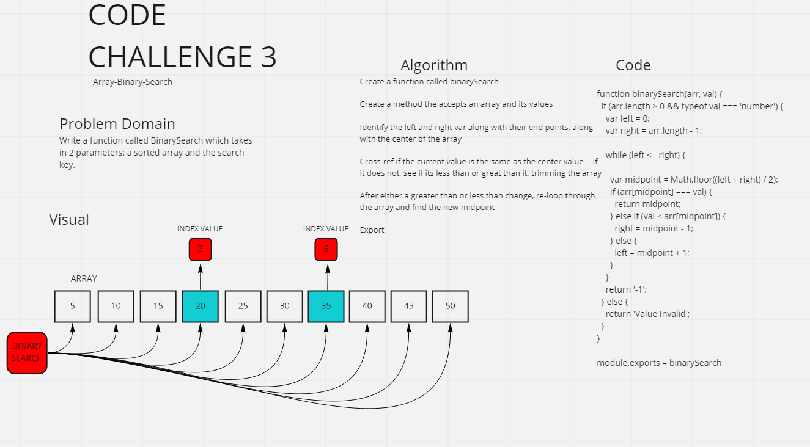

# Graph Implementation - CC #3

## Challenge #3 - Array Binary Search
Write a function called BinarySearch which takes in 2 parameters: a sorted array and the search key.

## Approach & Efficiency
- Without utilizing any of the built-in methods available to your language, return the index of the array’s element that is equal to the value of the search key, or -1 if the element is not in the array.

- The search algorithm used in your function should be a binary search.

- Identify left and right end points as well as the center value

- Loop back through after determining if the value is greater than or less than the current mid point

## Solution
