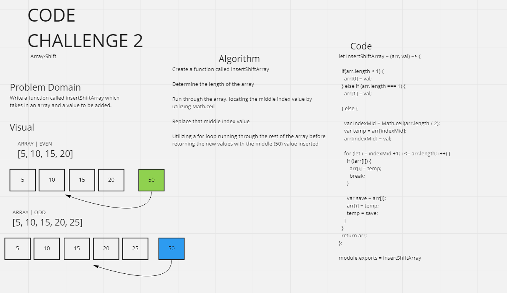

# Graph Implementation - CC #2

## Challenge
Write a function called insertShiftArray which takes in an array and a value to be added. 

## Approach & Efficiency
- Without utilizing any of the built-in methods available to your language, return an array with the new value added at the middle index.

- Utilize arr.length

- Utilize if and else statements

- Utilizie for loop

- Utilize Math.ceil()

- Test for an empty array, a value being detected within an array totaling a odd number of values and an even number of values

## Solution
