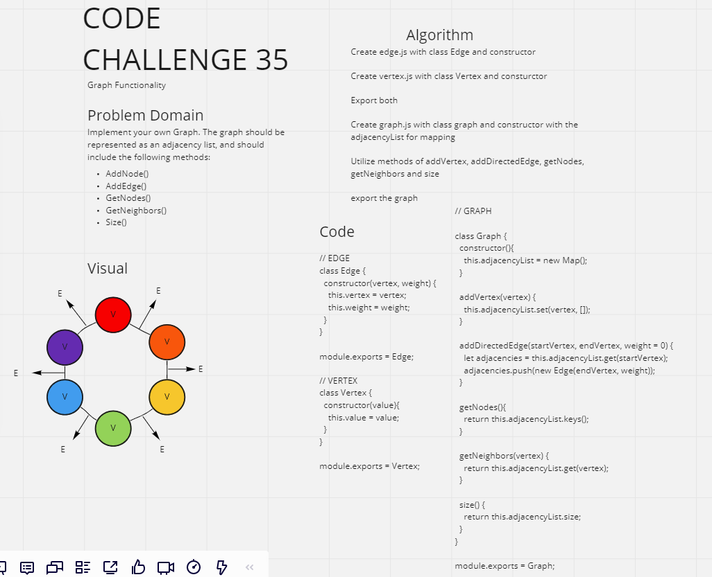
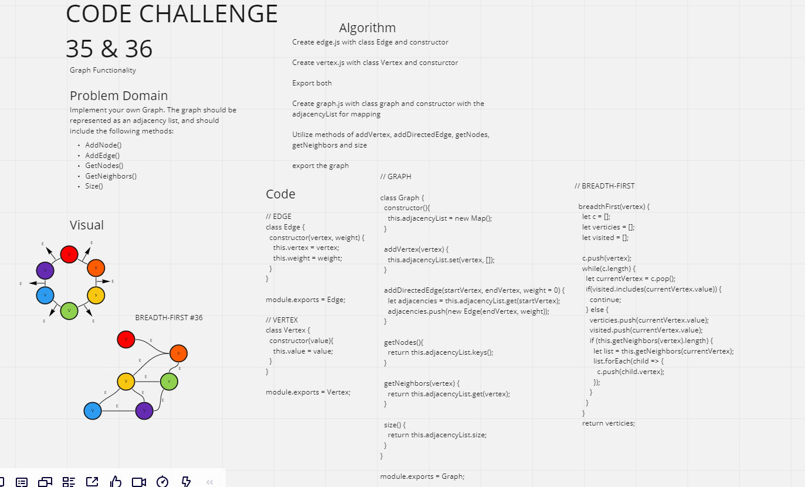
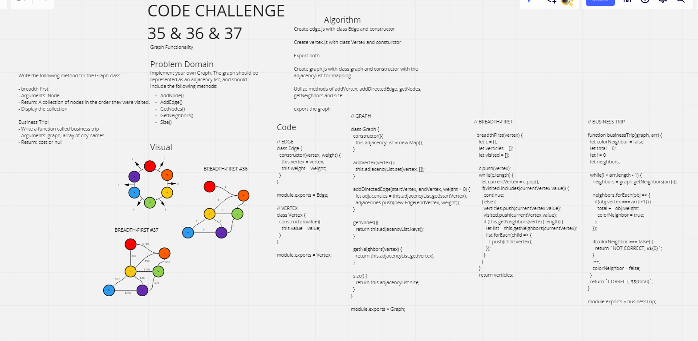

# Graph Implementation - CC #35 | #36 | #37

## Challenge
#35: Implement your own Graph. The graph should be represented as an adjacency list.

#36: Implement a breadth-first traversal on a graph.

#37: Determine whether the trip is possible with direct flights, and how much it would cost.

## Approach & Efficiency
- Utilize the following Methods:

- AddNode()
-- Adds a new node to the graph
-- Takes in the value of that node
-- Returns the added node

- AddEdge()
-- Adds a new edge between two nodes in the graph
-- Include the ability to have a “weight”
-- Takes in the two nodes to be connected by the edge
-- Both nodes should already be in the Graph

- GetNodes()
-- Returns all of the nodes in the graph as a collection (set, list, or similar)

GetNeighbors()
-- Returns a collection of edges connected to the given node
-- Takes in a given node
-- Include the weight of the connection in the returned collection

Size()
-- Returns the total number of nodes in the graph

Write the following method for the Graph class:

- breadth first
- Arguments: Node
- Return: A collection of nodes in the order they were visited.
- Display the collection

Business Trip:
- Write a function called business trip
- Arguments: graph, array of city names
- Return: cost or null

## Solution

