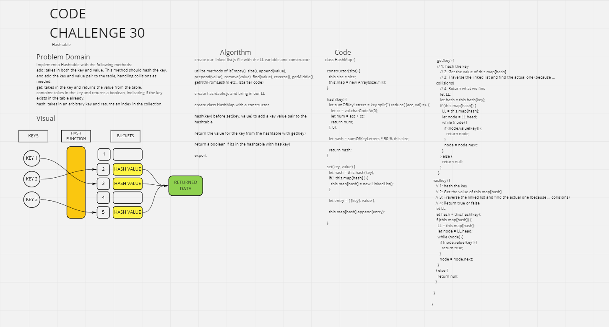

# Hashtable - CC30

## Challenge
CC 30 -- Hashtable

Implement a Hashtable with the following methods:
add: takes in both the key and value. This method should hash the key, and add the key and value pair to the table, handling collisions as needed.
get: takes in the key and returns the value from the table.
contains: takes in the key and returns a boolean, indicating if the key exists in the table already.
hash: takes in an arbitrary key and returns an index in the collection.

## Approach & Efficiency
- Ensure the linked-list.js is created and utilized.
- Utilize the Single-responsibility principle: any methods you write should be clean, reusable, abstract component parts to the whole challenge.
- Utilize the .hash(), .set(), .get() & .has() methods as demoed in class during the hashtable review

## Solution

