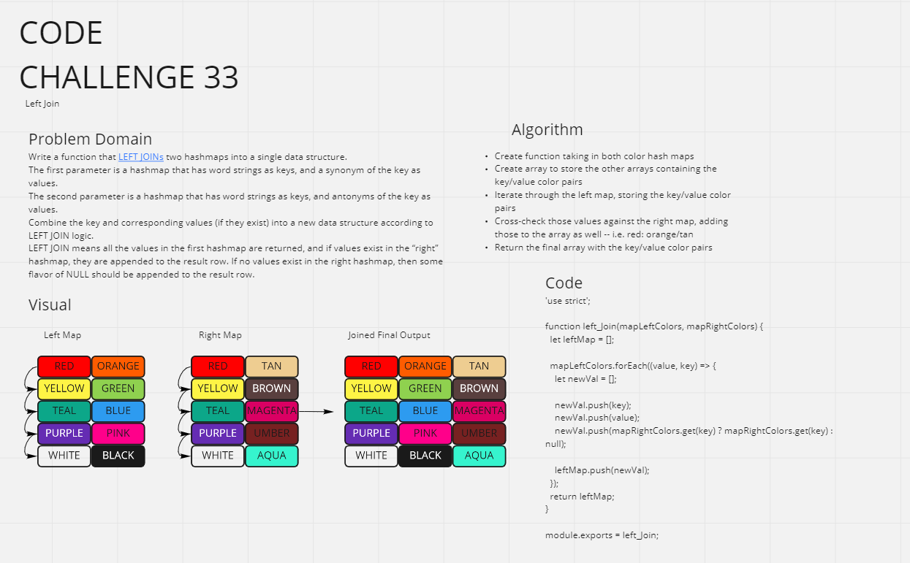

# Left Join | CC33

## Challenge
CC33 - Left Join

- Write a function that LEFT JOINs two hashmaps into a single data structure.
The first parameter is a hashmap that has word strings as keys, and a synonym of the key as values.
The second parameter is a hashmap that has word strings as keys, and antonyms of the key as values.
Combine the key and corresponding values (if they exist) into a new data structure according to LEFT JOIN logic.

- LEFT JOIN means all the values in the first hashmap are returned, and if values exist in the “right” hashmap, they are appended to the result row. If no values exist in the right hashmap, then some flavor of NULL should be appended to the result row.

- The returned data structure that holds the results is up to you. It doesn’t need to exactly match the output below, so long as it achieves the LEFT JOIN logic.

- Avoid utilizing any of the library methods available to your language.

## Approach & Efficiency
- Create function taking in both color hash maps

- Create array to store the other arrays containing the key/value color pairs

- Iterate through the left map, storing the key/value color pairs

- Cross-check those values against the right map, adding those to the array as well -- i.e. red: orange/tan

- Return the final array with the key/value color pairs

## Solution
