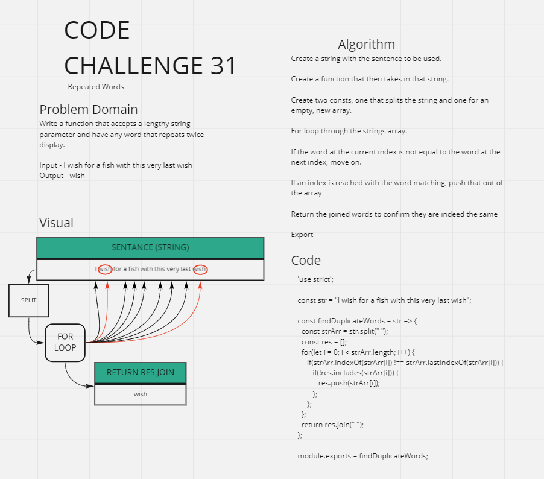

# Repeated Words - CC31

## Challenge
CC 31 - Repeated Words

Find the first repeated word in a book.

Write a function that accepts a lengthy string parameter.
Without utilizing any of the built-in library methods available to your language, return the first word to occur more than once in that provided string.

## Approach & Efficiency
- Create a string with a sentance that contains at least one word more than once.
- Utilize the .split method and an empty array.
- Create a function that takes in that string with a for loop.
- Locate the correct index to verify if the words are the same or not with .includes and .push
- Test for the first word that is repeated (in this case, wish)
- Test for correct case sensativity from within the string (lowercase)

## Solution

